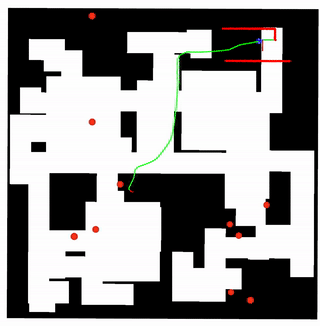

# All-in-One Planner
In this branch a drl planner called All-In-One Planner (AIO) is developed which chooses from a given list of local planners in each iteration. The goal is to combine the strengths of drl planners and classical planners like TEB / MPC.



### Fully trained AIO planners:
1. Turtlebot3 : AIO s+d and AIO fx3
2. Jackal: AIO s+d
3. RTO: AIO s+d
4. Youbot: AIO s+d

# Installation
Please note that this branch was developed for Ubuntu 18 and ROS Melodic. For more details please refer to the installation readme in this branch.

Additionally, a few python packages have to be installed into the virtual environment: ZeroMQ, TQDM and joblib

```bash
workon rosnav
pip install pyzmq
pip install tqdm
pip install joblib
```

Check if Flatland is in the right branch "drl_all_in_one_planner_johannes":
```bash
cd catkin_ws/src/forks/Flatland
git checkout drl_all_in_one_planner_johannes

```
Don't forget to execute catkin_make again.


# Training
Currently 4 robot models are supported for training: burger (Turtlebot3), youbot, rto_real and jackal. Addtional robot models can be added in the simulator_setup/robot folder. An AIO planner can be defined through its config file. AIO config files are placed  in
```bash
cd catkin_ws/src/arena-rosnav/arena_navigation/arena_local_planner/learning_based/arena_local_planner_drl/configs/all_in_one_hyperparameters/agent_parameters/aio_configs
```
Here you can also find examples from existing AIO planners. Here is an annoted example:
```json
{
 "models": {
   "drl": ["turtlebot3-burger"], # DRL-Rosnav planners (have to be placed in agents/rosnav-agents)
   "drl_names": ["rosnav-drl"], # Name of DRL planners (only for logging & visualization)
   "model_based": [ # List of all model-based planners specified b their config file (have to be placed in configs/base_local_planner_parameters)
     "teb_static_obst.yaml"
   ],
   "model_based_names": [
     "teb"
   ]
 },
 "update_global_plan_frequency": 9, # global planner update interval in multiple of 100ms
 "all_in_one_planner_frequency": 3, # AIO planner update interval in multiple of 100ms
 "observation_space": { # Observation space information
   "laser_range": "full", # Can be full or reduced
   "laser_stack_size": 3, # Number of consecutive laser scans that are used
   "add_robot_velocity": true,
   "use_dynamic_scan": false
 }
}
```
Currently integrated local planners:
1. DRL-based local planners: Rosnav-DRL, Arena-DRL (only Burger), RLCA (only Burger)
2. Model-based local planners: TEB, TEB with Obstacle Tracking, DWA, MPC, eBand (and local planners that implement the ROS base_local_planner interface)

During training with multiprocessing it is recommended to use the setting
```json
"models": {
  "use_drl_servers": 1,
}
```
This only uses one copy of DRL-Rosnav, which saves a lot of GPU memory.

### Training a new AIO agent:

```bash
cd catkin_ws/src/arena-rosnav/arena_navigation/arena_local_planner/learning_based/arena_local_planner_drl/scripts/training
sh tmux_train.sh $num_envs $aio_config_filename $hyperparam_filename $pre_train_dataset_file $robot_model $neural_network_architecture
```

1. pre_train_dataset_file: Filename of the pre-training dataset. Has to be placed in the folder agents/aio-agents/2. pretrained_aio_agents. How new pre-training can be created is expounded in the next section
2. neural_network_architecture: Network architectures are name as AGENT_$(nn_number) and placed in the file scripts/all_in_one_policies.py. The selected NN architecture has to match the observation space of the AIO planner


### Generate new Pre-Training Dataset
```bash
cd catkin_ws/src/arena-rosnav/arena_navigation/arena_local_planner/learning_based/arena_local_planner_drl/scripts/training
sh tmux_create_expert_dataset.sh $number_samples $num_envs $robot_model $pretrain_config $use_dnamic_scan
```
1. number_samples: Size of pre-training Dataset
2. num_envs: Number of environments used to generate the Dataset
3. robot_model: Name of robot model (supported: (Turtlebot3), youbot, rto_real and jackal)
4. pretrain_config: Name of Pre-Training AIO config. Has to be the same as the AIO config file except that 'use_dnamic_scan' has to be set true.
5. use_dnamic_scan: Boolean wether the AIO planner will use the dynamic / static scan laser division


# Evaluate agents
AIO and all integrated local planners can be evaluated. During evaluation the behavior can be observed manually. Furthermore, a variety of metrics are automatically recorded and saved at the end.

```bash
cd catkin_ws/src/arena-rosnav/arena_navigation/arena_local_planner/learning_based/arena_local_planner_drl/scripts/training
sh tmux_eval.sh $robot_model
```
The evluation settings like name of the evluation, the map, the planners and number of episodes can be set in the file scripts/training/evaluate_all_in_one_planner.py

The results of the evaluation will be saved to the evaluation_log/ folder.
